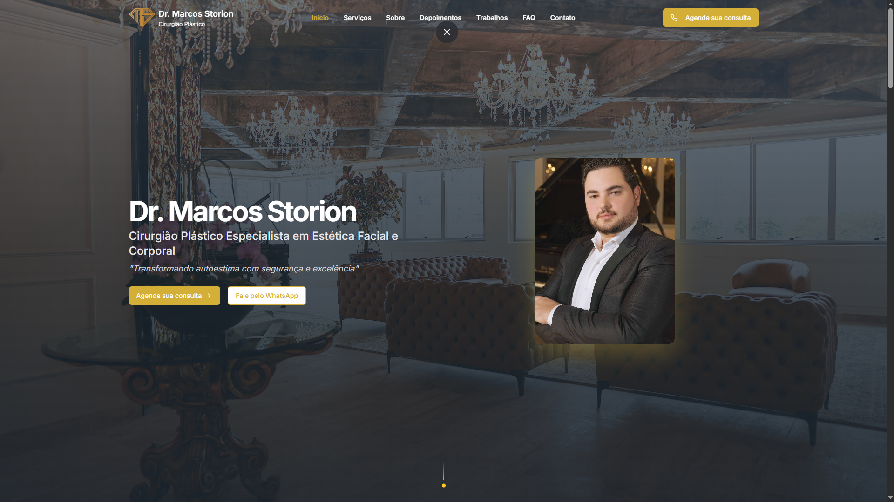
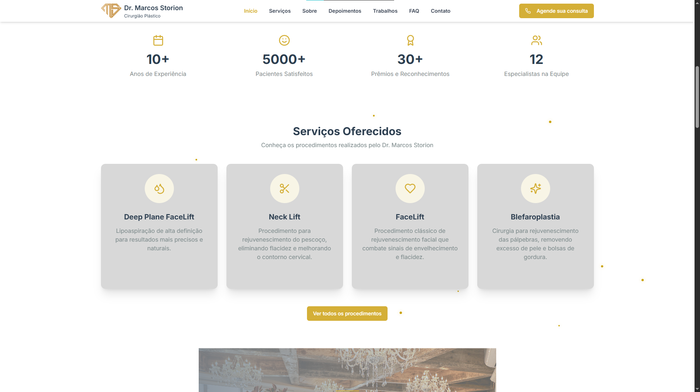
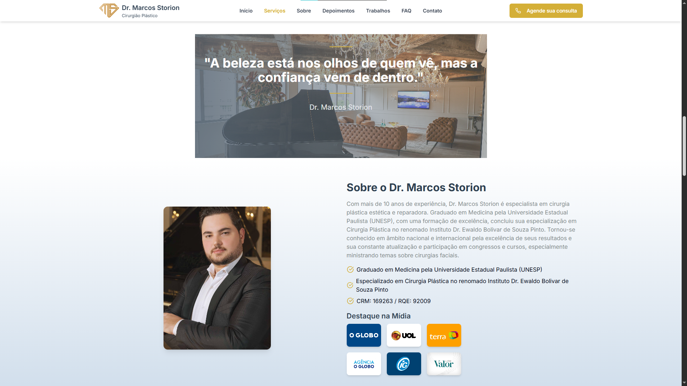
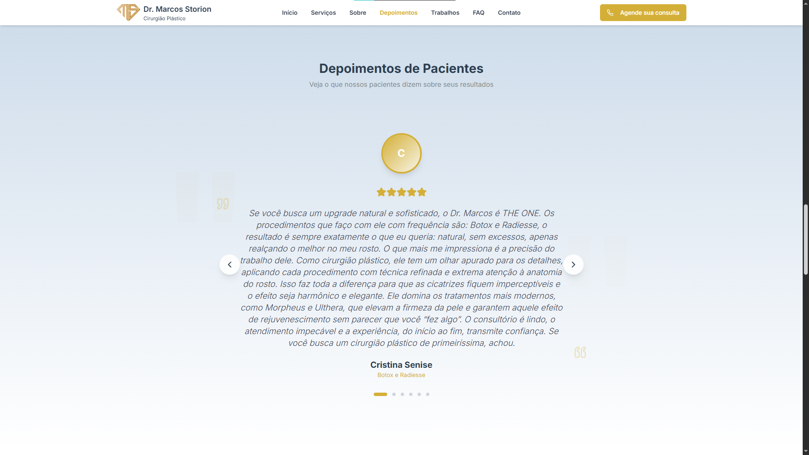
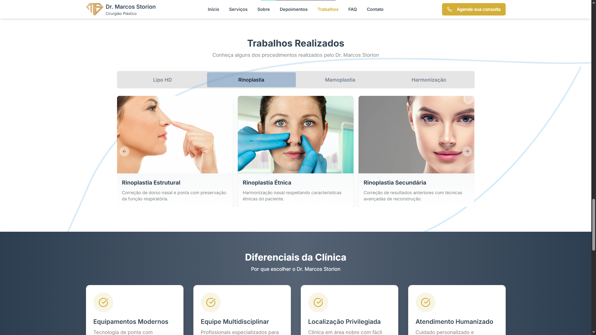
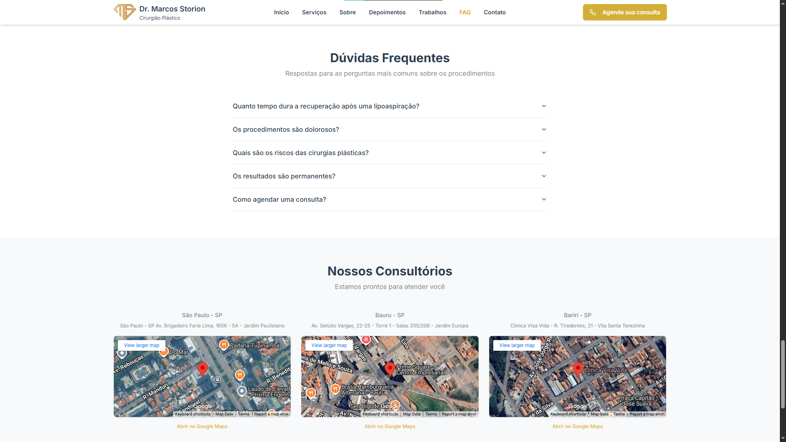

# 💉 Dr. Marcos Storion – Cirurgia Plástica de Excelência

Landing page institucional e informativa criada para apresentar os serviços do **Dr. Marcos Storion**, especialista em cirurgia plástica facial e corporal. O site valoriza a autoridade médica, mostra resultados reais e oferece uma navegação intuitiva para agendamentos e informações.

---
🔗 Site em produção: https://dr-marcos-storion.vercel.app/
---
## 📸 Screenshots

| Página Inicial | Serviços | Sobre |
|----------------|----------|-----------|
|  |  |  |

| Depoimentos | Trabalhos | FAQ |
|----------------|-------------|------------|
|  |  |  |

---

## 🚀 Tecnologias Utilizadas

- **[Next.js](https://nextjs.org/)** – Framework React com SSR, ideal para SEO e performance.
- **[Tailwind CSS](https://tailwindcss.com/)** – Estilização moderna, responsiva e modular.
- **[Framer Motion](https://www.framer.com/motion/)** – Animações suaves e elegantes.
- **[Swiper.js](https://swiperjs.com/)** – Slider responsivo para mostrar depoimentos e trabalhos realizados.

---

## 📂 Estrutura do Projeto

```bash
.
├── public/
│   └── images/             # Imagens do site e assets
├── src/
│   ├── app/                # Rotas e páginas
│   ├── components/         # Componentes reutilizáveis
│   ├── hooks/              # Reutilização de lógicas
│   └── styles/             # Estilos globais e utilitários
└── README.md
````

---

## 🧪 Como Rodar o Projeto

```bash
# Clone o repositório
git clone https://github.com/Faccin27/DR_Marcos_Storion
cd dr-marcos-storion

# Instale as dependências
npm install

# Rode em ambiente de desenvolvimento
npm run dev
```

---

## 📦 Build para Produção

```bash
npm run build
npm start
```

---

## 📱 Responsividade

Site desenvolvido com foco em **usabilidade mobile**, especialmente otimizado para dispositivos móveis onde a maioria dos agendamentos e visitas ocorrem.

---

## 💡 Destaques do Projeto

* Estrutura focada em conversão de visitantes em pacientes
* Prova social com depoimentos e resultados reais
* Layout moderno e elegante com linguagem visual médica
* Sessão de perguntas frequentes para reduzir objeções
* SEO e performance priorizados

---

## 📬 Contato

**Desenvolvido por** \[FaccinDev] – [gfaccin27@gmail.com](mailto:gfaccin27@gmail.com)

---

## 🧾 Licença

Este projeto foi desenvolvido exclusivamente para o Dr. Marcos Storion. Uso ou reprodução sem autorização não é permitida.
